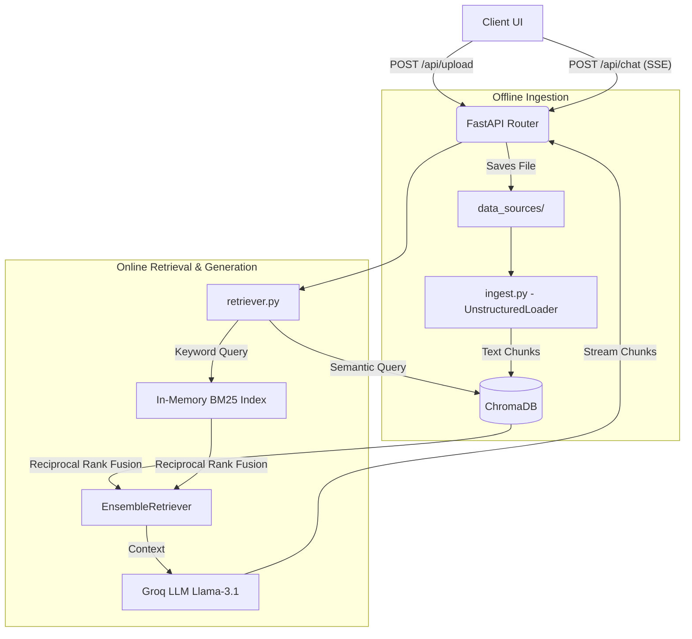

<div align="center">
  <h1>OmniRAG Backend</h1>
  <p>A modular, high-performance Retrieval-Augmented Generation API built with FastAPI and LangChain.</p>

  <!-- Badges -->
  <a href="https://fastapi.tiangolo.com/"></a>
  <a href="https://python.langchain.com/"></a>
  <a href="https://groq.com/"></a>
  <a href="https://www.trychroma.com/"></a>
  <a href="https://docs.astral.sh/uv/"></a>
</div>

<br />

## Overview

This repository houses the backend infrastructure for a high-speed, scalable RAG system. It exposes a fully asynchronous REST API to handle document ingestion, hybrid vector/keyword search, and token-by-token streaming inference using Groq's LLaMA 3.1 architecture.

The system is designed with a strict Separation of Concerns, isolating the **Offline Indexing Pipeline** (ingestion) from the **Online Query Pipeline** (serving requests).

---

## Features

- **Ultra-Fast Inference:** Powered by Groq for near-instantaneous token generation.
- **Hybrid Search Retriever:** Combines Semantic Vector Search (ChromaDB + HuggingFace Embeddings) with Exact Keyword Match (BM25) using Reciprocal Rank Fusion.
- **Server-Sent Events (SSE):** True character-by-character streaming responses for seamless UI integration.
- **Universal File Ingestion:** Automatically parses and chunks `.pdf`, `.txt`, `.csv`, `.md`, and `.docx` files via `Unstructured`.
- **Docker Ready:** Fully containerized for instant local development and production deployment.
- **Observability:** Deep integration with LangSmith for token tracking, chain debugging, and latency monitoring.

---

## Architecture



---

## Quick Start

### Prerequisites
- [Docker](https://www.docker.com/) & [Docker Compose](https://docs.docker.com/compose/)
- Groq API Key (Get one free at [console.groq.com](https://console.groq.com))

### 1. Environment Setup
Clone the repository and create your environment file:
```bash
cp .env.example .env
```
Add your keys to `.env`:
```env
GROQ_API_KEY=gsk_your_api_key_here
LANGSMITH_API_KEY=lsv2_your_langsmith_key_here
LANGSMITH_TRACING=true
LANGSMITH_PROJECT=rag-production
```

### 2. Run with Docker (Recommended)
Boot the entire backend environment with a single command:
```bash
docker-compose up --build
```
The API is now live at `http://localhost:8000`.

---

## Manual Local Setup

If you prefer to run the application on bare-metal using the `uv` package manager:

```bash
# 1. Sync dependencies and create virtual environment
uv sync

# 2. Run the ingestion pipeline (optional, automatically triggered on upload)
uv run python ingest.py

# 3. Start the FastAPI server
uv run uvicorn main:app --reload
```

---

## API Reference

### `POST /api/upload`
Uploads a document to the system and triggers the background ingestion pipeline.
- **Accepts:** `multipart/form-data`
- **Supported Formats:** `.pdf`, `.csv`, `.docx`, `.txt`, `.md`
- **Response:** `{"message": "File uploaded successfully. Ingestion started in background."}`

### `POST /api/chat`
Submits a conversation thread and streams back the AI's response using RAG.
- **Accepts:** `application/json`
```json
{
  "messages": [
    { "role": "user", "content": "What is the company's Q3 revenue?" }
  ]
}
```
- **Response:** `text/event-stream` (Server-Sent Events)

---

## Core Modules

- **`config.py`**: Global configuration hub, LLM initialization, and caching logic.
- **`database.py`**: Manages the persistent ChromaDB connection and dynamically builds the in-memory BM25 keyword index on startup.
- **`ingest.py`**: Offline indexing script utilizing `UnstructuredFileLoader` for universal document parsing and smart chunking strategies.
- **`retriever.py`**: The RAG brain. Orchestrates the `EnsembleRetriever` and formats the final prompt before streaming the Groq LLM response.
- **`main.py`**: The FastAPI application entrypoint, defining routes, CORS policies, and background tasks.

---

<div align="center">
  <i>Built for High-Performance AI Engineering</i>
</div>
